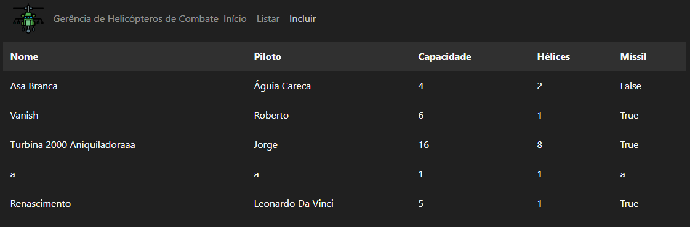

# Web development - Python with Flask

Back-end and Front-end system with JSON communication.

[Versão em português](README.pt.md)

## Introduction

This project uses [Flask](https://flask.palletsprojects.com/en/1.1.x/) and
[SQLAlchemy](https://www.sqlalchemy.org/) libs to make a simple web server.
Created for evaluations of the subject Programming II.

## Installation

Make sure you are in the `fNb-end` folder and run the following code on terminal:

```bash
python -m pip install -r requirements.txt
```

## Usage

After installing all libraries, run the back-end server launch command:

```bash
python src/backend/run.py
```

On terminal, you might see this:


Then, open `index_helis.html`, from the folder `fNb-end/frontend`, manually,
in your browser

Your server receives a GET request to access the data, and your terminal will update
similar to this:


And your browser will render the following wellcome page:


You can change the pages through the menu bar (Home / List / Include)

In list page you can see the following table:


And you can include some data like that:


Then the table will render its included data



## Constribution

If you have some doubt or you developed a feature, create a pull request to the update.

Thanks!