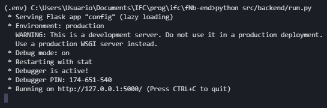
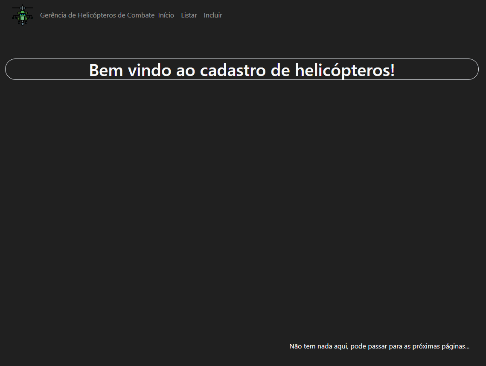
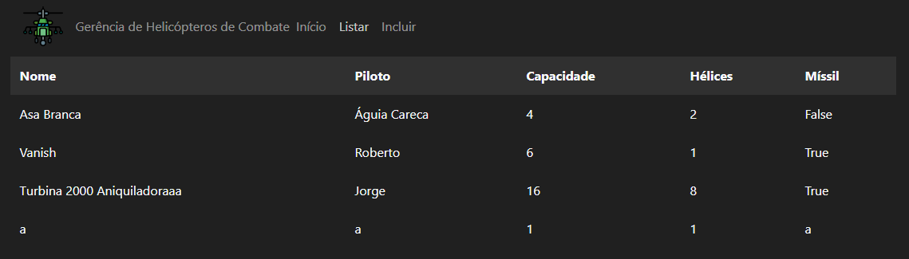
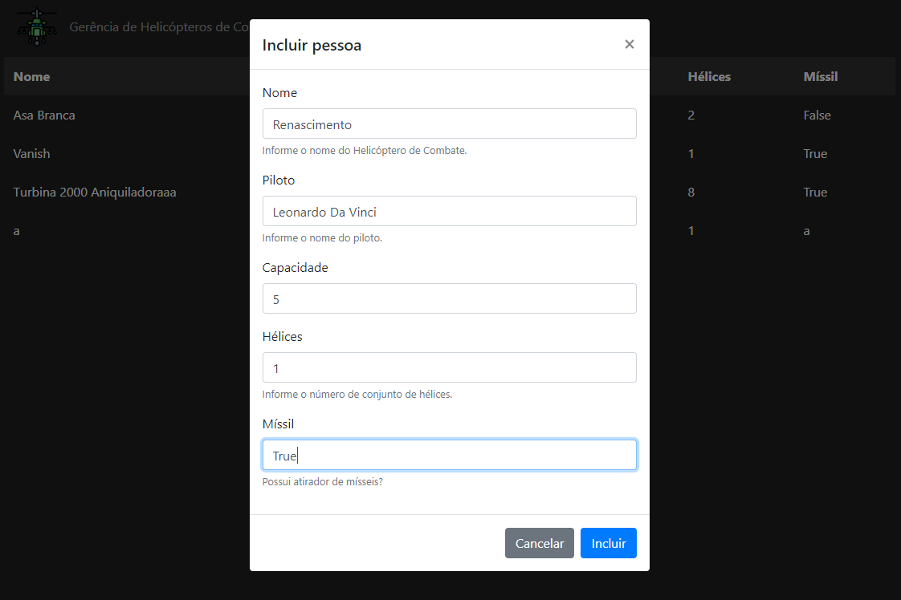
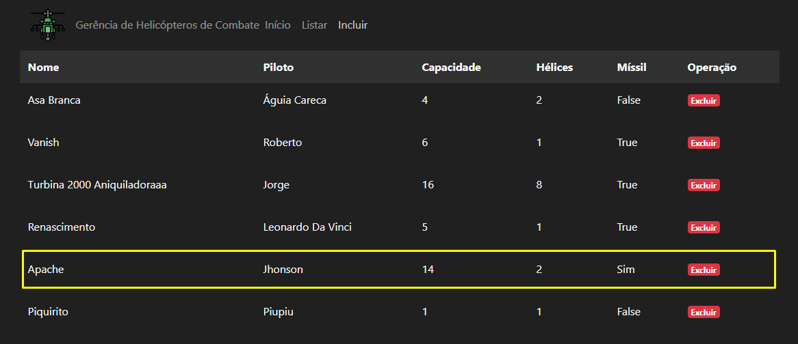
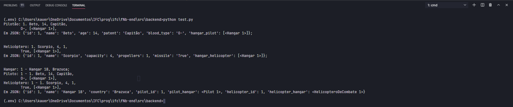
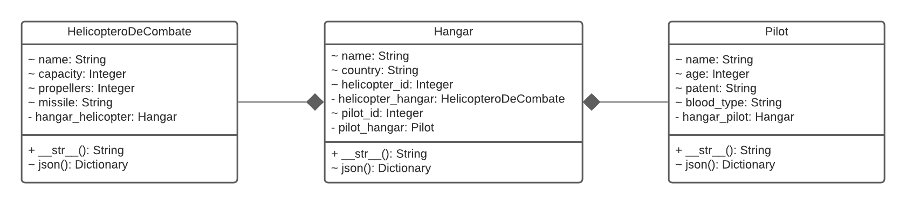
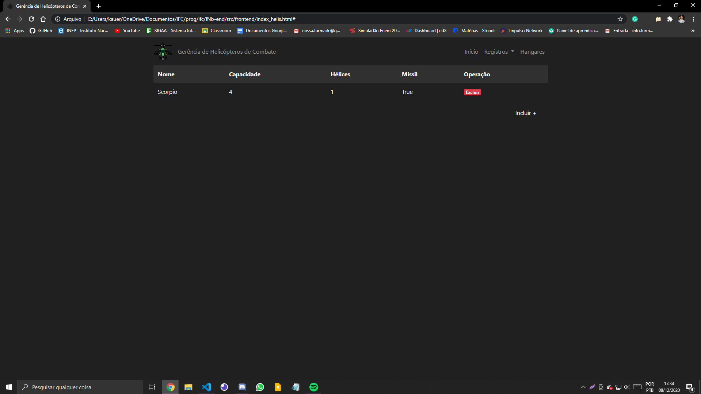

# Web development - Python with Flask

Back-end and Front-end system with JSON communication.

[Versão em português](README.pt.md)

## Introduction

This project uses [Flask](https://flask.palletsprojects.com/en/1.1.x/) and
[SQLAlchemy](https://www.sqlalchemy.org/) libs to make a simple web server.
Created for evaluations of the subject Programming II.

## Installation

Make sure you are in the `fNb-end` folder and run the following code on terminal:

```bash
python -m pip install -r requirements.txt
```

## Usage

After installing all libraries, run the back-end server launch command:

```bash
python src/backend/run.py
```

On terminal, you might see this:



Then, open `index_helis.html`, from the folder `fNb-end/frontend`, manually,
in your browser

Your server receives a GET request to access the data, and your terminal will update
similar to this:


And your browser will render the following wellcome page:



You can change the pages through the menu bar

### List Function

In list page you can see the following table:



### Create Function

And you can include some data like that:



Then the table will render its included data


### Delete Function

If you include some wrong data, you can delete the line clicking in the badge written "Excluir".



Then it's fade out:


### Composition and Aggregation

After implementing two new classes, the tests show the relationship between them:



Following the UML diagram bellow:



### Listing classes

After updating the front-end, check the following pages:

__Combat Helicopters__



__Pilots__


__Hangars__


## Constribution

If you have some doubt or you developed a feature, create a pull request to the update.

Thanks!