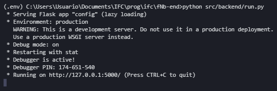
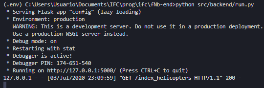
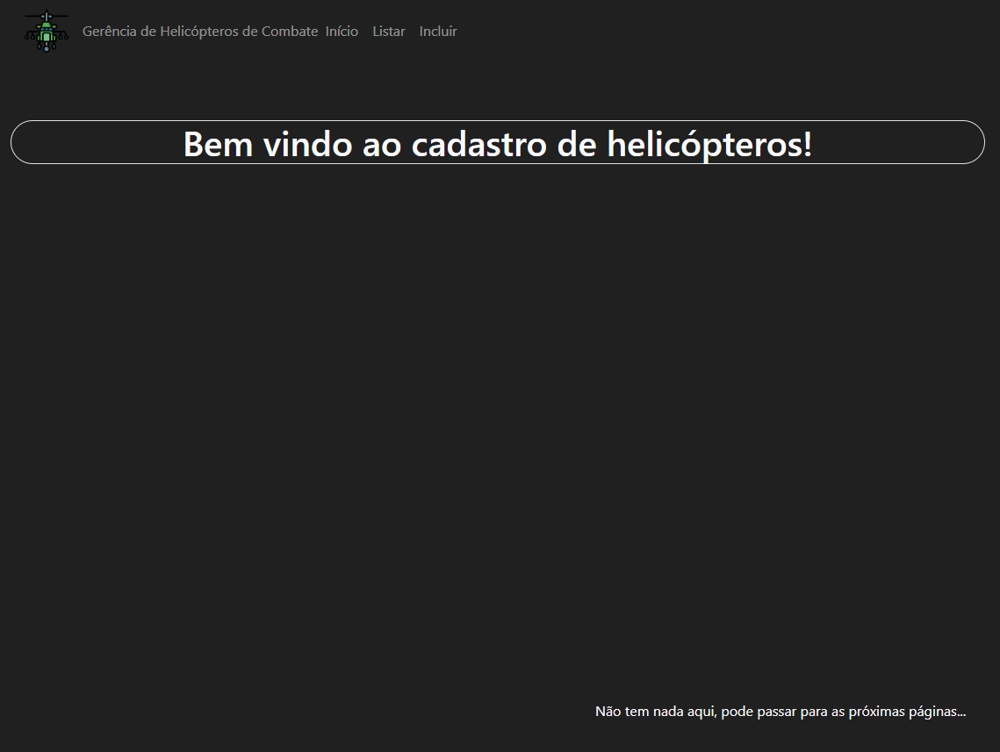
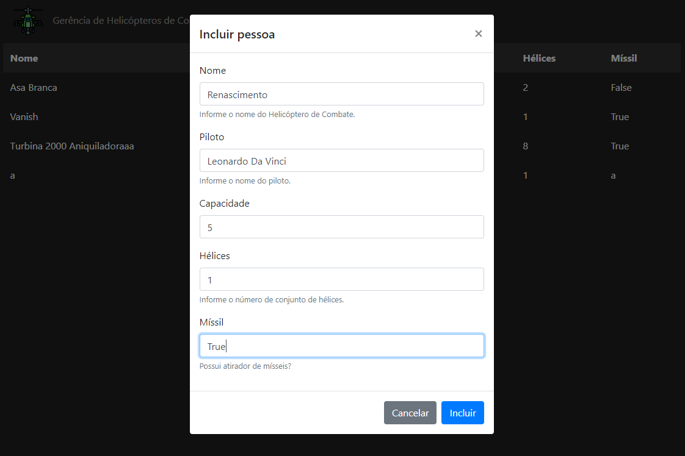
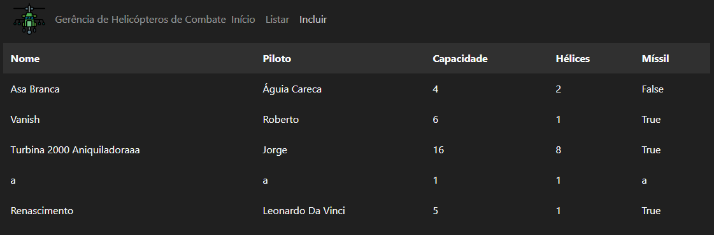
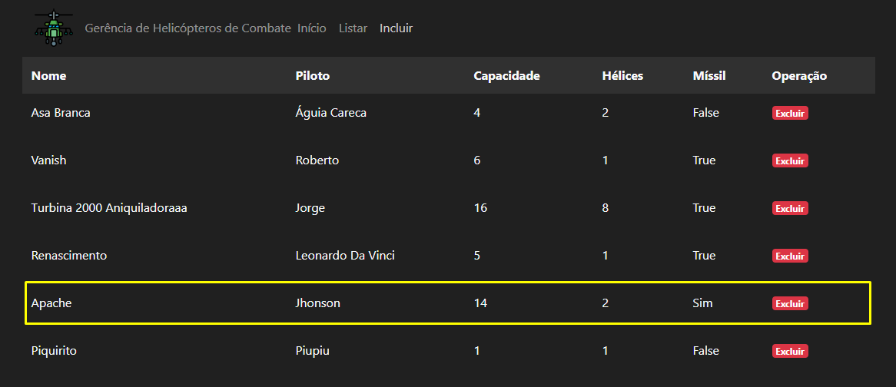
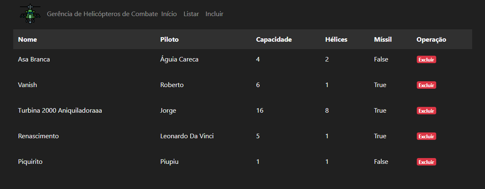
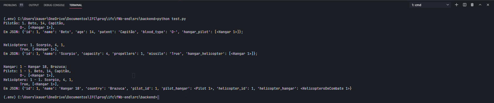
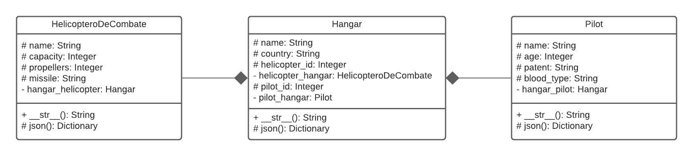

# Desenvolvimento Web - Python with Flask

Sistema back-end e front-end com comunicação por JSON.

[English version](README.md)

## Introdução

Esse projeto utiliza as bibliotecas [Flask](https://flask.palletsprojects.com/en/1.1.x/)
 e [SQLAlchemy](https://www.sqlalchemy.org/) para produzir um servidor web simples.
Criado para avaliações da disciplina de Programação II.

## Instalação

Certifique-se que você esteja na pasta `fNb-end` e execute o seguinte código em seu terminal:

```bash
python -m pip install -r requirements.txt
```

## Usabilidade

Após a instalação de todas as bibliotecas, execute o comando de iniciação do servidor
back-end:

```bash
python src/backend/run.py.py
```
Em seu terminal, aparecerá algo parecido com isso:



Então, abra o arquivo `index_helis.html`, da pasta `fNb-end/frontend`, manualmente,
em seu navegador.

Seu servidor receberá uma requisição `GET` de acesso aos dados, e seu terminal atualizará
semelhante a isso:



E seu navegador deverá renderizar a seguinte página de boas-vindas:



Você pode alterar nas diferentes sessões pela barra de menu

### Função Listar

Na página de listagem você poderá ver os dados que já foram inseridos no banco de dados:


### Função Incluir

E você pode inserir alguns dados conforme segue a imagem:



Então a tabela se atualizará com os dados inseridos



### Função Deletar

Se você incluir algum dado errado, você pode deletar a linha clicando na operação de "Excluir".



Então a linha desaparece:



### Composição e Agregação

Depois da implementação de duas novas classes, os testes mostram o relacionamento entre elas:



Seguindo o Diagrama UML abaixo:



## Contribuição

Se houver alguma dúvida, ou incremento para este, crie um pull request para a
atualização.

Obrigado!
